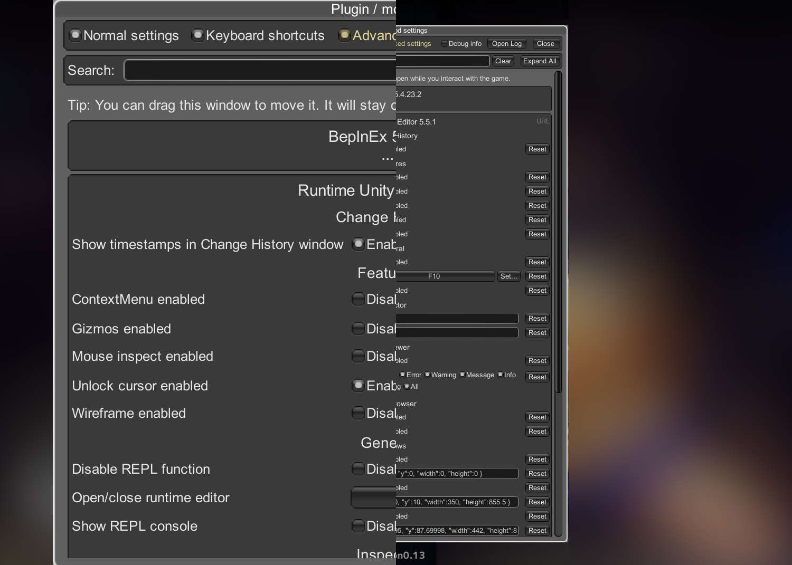

# Unity.IMGUI.HiDPI.Patcher

A BepInEx patcher that fixes small IMGUI UI on HiDPI screen.;

Demo image of non-loss scaling.



## How?

Actually it's very straightforward.

So the IMGUI utility actually come with a transformation matrix as `GUI.matrix`, and with

```cs
var scale = 2.0f;
GUI.matrix *= Matrix4x4.Scale(new Vector3(scale, scale, 1.0f));
```

in `OnGUI()` callback, all following UI draws would have UI scaled by `2.0` automatically.

And events like mouse position would still works. It's that simple.

However if UI component draws elements with absolute size referencing screen rectangle,
those elements would probably overflow out of the screen.

To address this issue, we hook on `Screen.width` and `Screen.height` to return scale downed screen size by the same factor we used for scaling up UI elements. And such UI component would draw elements in this scale downed region, and when re-scaled up, every element would stays in the same relative screen position just like without scaling but with pixels-per-UI added up.

## Implement HiDPI scaling for your IMGUI application

If you are a plugin author, it should be easy to adapt this method to your `OnGUI` loop.
And this doesn't requires you any structural change for UI drawing.

Here are the basic steps to implement HiDPI scaling for IMGUI.

1. Calculate DPI `scale` with `Math.Max(Screen.height / 1080.0f, Screen.width / 1920.0f)`, your UI is presumably designed for 1920x1080 so it's reasonable to just calculate scale factor from that.

2. Scale `GUI.matrix` by `scale` using transformation matrix in the head of `MonoBehaviour.OnGUI` callback, all UI elements draw after this would be scaled up transparently from top-left to bottom-right.

3. Instead of referencing screen border with `Screen.width` and `Screen.height`, reference scale downed version of them, i.e. `Screen.width/scale` and `Screen.height/scale`. And with UI scaling in step 2, the final rendering result would have your UI element referencing to actual screen border just like there was no scaling.

4. If you use coordinate conversion utilities like `GUIUtility.ScreenToGUIPoint` and `GUIUtility.GUIToScreenPoint`, set `GUI.matrix` to `Matrix4x4.identity` otherwise you would get scaled results. Just like other drawing operations, they are transparent to final scaling, so do these coordinate should remain unscaled. Note also make sure to save and revert back to the previous "scaling" `GUI.matrix`.

5. If your plugin needs to coexist with this patcher, edit the config file of `IMGUI.HiDPI.Patcher.{Mono,IL2CPP}.cfg` and add the namespace matcher of your UI component into `OptOutNsRegex` in `[Opt-out]`.

And that's it!
